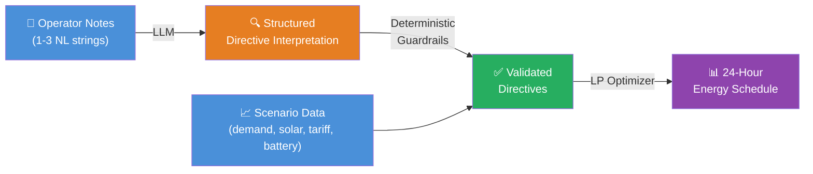
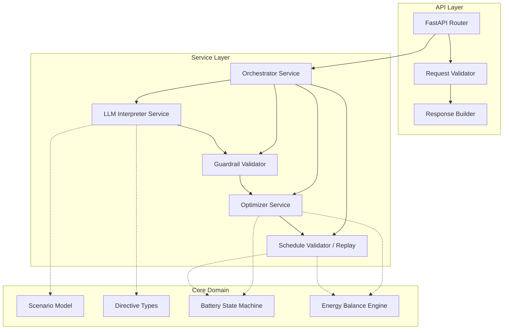

# GridWise LLM — Complete PRD & Winning Implementation Plan

## BUP CSE Fest 2026 Hackathon · Online Preliminary Round

> **Time constraint**: 4 hours (7:00 PM – 11:00 PM)
> **Goal**: Build an HTTP API that interprets operator notes via LLM, validates them through deterministic guardrails, and produces a cost-minimized 24-hour energy schedule.

---

## 1. Problem Decomposition

The challenge is a **three-stage pipeline**:



### Stage 1 — LLM Interpretation (25 pts)
- Parse 1-3 natural-language operator notes
- Classify each as one of 6 directive types or `no_op`
- Extract structured parameters (hours, factor, kWh values)

### Stage 2 — Deterministic Guardrails (part of 25 pts)
- Validate LLM output against strict rules
- Sanitize hours, numeric ranges, directive types
- Reject/correct malformed LLM responses

### Stage 3 — Linear Programming Optimizer (10 pts + 25 pts constraint correctness)
- Apply validated directives as constraints
- Minimize `total_cost_bdt = Σ(grid_kwh[h] × tariff[h])`
- Satisfy all battery, energy-balance, and directive rules

---

## 2. Scoring Strategy — Mapping to 100 Points

| # | Category | Pts | Our Strategy |
|---|----------|-----|--------------|
| 1 | **LLM Directive Interpretation** | 25 | Gemini 2.5 Flash with structured output + few-shot prompting. Cover all 6 directive types + `no_op`. Handle paraphrases via LLM generalization. |
| 2 | **Directive Application & Constraint Correctness** | 25 | Every validated directive becomes a hard LP constraint. Post-solve replay verifies every directive was actually applied. |
| 3 | **Optimization Quality** | 10 | OR-Tools LP solver (CBC backend) guarantees globally optimal solution for LP formulation. `quality_ratio = min(1, optimal_cost / our_cost)`. |
| 4 | **API Contract & Schema** | 10 | Pydantic models enforce exact schema. Request validation returns 400/422. Response echoes `scenario_id`. |
| 5 | **Performance & Reliability** | 10 | Target p95 < 3s. Gemini Flash is fast (~1s). LP solve is instant (<100ms). Graceful error handling for malformed input & LLM failures. |
| 6 | **Deployment & Docker Fallback** | 10 | Deploy on Railway/Render + Docker image on GHCR. Single `docker run` command. |
| 7 | **Documentation & Local Reproducibility** | 10 | Comprehensive README with quickstart, curl examples, env vars, architecture explanation. |
| | **TOTAL** | **100** | |

---

## 3. Tech Stack Decision

### 3.1 Language: **Python 3.12**

**Why Python wins for this hackathon:**
- Fastest prototyping speed (4-hour constraint is tight)
- Best ecosystem for LP solvers, LLM SDKs, and web frameworks
- OR-Tools has first-class Python bindings
- Gemini SDK (`google-genai`) is Python-native
- FastAPI provides auto-validation with Pydantic

### 3.2 Full Stack

| Component | Choice | Rationale |
|-----------|--------|-----------|
| **Web Framework** | **FastAPI** (latest) | Async, auto-OpenAPI docs, Pydantic validation, fastest Python framework |
| **ASGI Server** | **Uvicorn** | Production-grade, works with FastAPI |
| **LLM Provider** | **Google Gemini 2.5 Flash** | Fast (low latency for p95 target), cost-effective, structured JSON output mode, excellent NLU |
| **LLM SDK** | **`google-genai`** (latest) | Official Google GenAI SDK |
| **LP Solver** | **Google OR-Tools** (`ortools`) | Free, fast, production-grade LP/MIP solver; CBC backend is more than sufficient for 24-variable LP |
| **Data Validation** | **Pydantic v2** | Strict schema validation, JSON serialization, comes with FastAPI |
| **Containerization** | **Docker** (multi-stage) | Slim image, reproducible builds |
| **Deployment** | **Railway** (primary) + **GHCR Docker** (fallback) | Railway has free tier, instant deploys, HTTPS out of the box |
| **Testing** | **pytest** + **httpx** | Async test client for FastAPI |
| **Linting** | **Ruff** | Fastest Python linter/formatter |

### 3.3 Key Dependencies (pinned versions in `requirements.txt`)

```
fastapi>=0.115.0
uvicorn[standard]>=0.30.0
pydantic>=2.9.0
google-genai>=1.0.0
ortools>=9.10
httpx>=0.27.0
python-dotenv>=1.0.0
```

> [!IMPORTANT]
> **Why OR-Tools over PuLP/scipy?**
> - OR-Tools LP solver is faster and more robust than PuLP's default GLPK
> - Single package, no external solver binaries needed
> - Guaranteed optimal solution for LP (not heuristic)
> - Excellent Docker compatibility (pre-built wheels)

> [!IMPORTANT]
> **Why Gemini 2.5 Flash over GPT-4o / Claude?**
> - Native structured JSON output mode (no parsing failures)
> - Very low latency (~0.5-1.5s for small prompts) — critical for p95 < 5s target
> - Free tier quota is generous for hackathon usage
> - Built-in safety, no hallucination guardrails needed at model level
> - Cost-effective if free tier is exhausted

> [!TIP]
> **Fallback LLM Strategy**: If Gemini is unavailable, we can swap to OpenAI GPT-4o-mini or a local Ollama model with minimal code changes — the LLM interface is abstracted behind a service layer.

---

## 4. Architecture

### 4.1 Clean Architecture — Layered Design



### 4.2 Request Processing Flow (Detailed)

```
POST /optimize-energy
  │
  ├─ 1. Pydantic validates request schema (400 if malformed)
  │
  ├─ 2. Orchestrator receives validated ScenarioRequest
  │
  ├─ 3. LLM Interpreter:
  │     ├─ Constructs prompt with scenario context + operator notes
  │     ├─ Calls Gemini 2.5 Flash with structured output schema
  │     ├─ Receives JSON array of directive interpretations
  │     └─ Returns raw LLM output (untrusted)
  │
  ├─ 4. Guardrail Validator:
  │     ├─ Validates directive_type ∈ allowed set
  │     ├─ Validates note_index mapping (unique, in order, covers all notes)
  │     ├─ Validates hours: unique ints 0-23, ascending order
  │     ├─ Validates solar factor: 0 ≤ factor ≤ 1
  │     ├─ Validates battery reserve: 0 ≤ value ≤ capacity
  │     ├─ Validates grid cap: ≥ 0, finite
  │     ├─ Validates applies semantics (no_op → false, else → true)
  │     ├─ Validates structured_adjustment shape per directive type
  │     └─ Returns validated directives (trusted)
  │
  ├─ 5. Optimizer (OR-Tools LP):
  │     ├─ Computes effective_solar (apply solar_reduction)
  │     ├─ Creates LP variables: grid[h], solar_used[h], charge[h], discharge[h]
  │     ├─ Adds base constraints (energy balance, battery bounds, rates)
  │     ├─ Adds directive constraints (reserve, no_charge, no_discharge, grid_cap)
  │     ├─ Sets objective: minimize Σ(grid[h] × tariff[h])
  │     ├─ Solves LP
  │     └─ Returns optimal schedule
  │
  ├─ 6. Schedule Replay Validator:
  │     ├─ Independently replays hour-by-hour
  │     ├─ Verifies energy balance at each hour
  │     ├─ Verifies battery state transitions
  │     ├─ Verifies all directive constraints are satisfied
  │     ├─ Verifies end-of-day battery neutrality
  │     ├─ Recalculates total_grid_kwh, total_cost_bdt, peak_grid_kwh
  │     └─ Returns validated response
  │
  └─ 7. Response Builder:
        ├─ Constructs response with scenario_id echo
        ├─ Attaches directive_interpretation array
        ├─ Attaches hourly_plan array
        ├─ Attaches recalculated totals
        ├─ Generates plan_summary via template (or brief LLM call)
        └─ Returns 200 JSON response
```

---

## 5. Project Structure

```
gridwise-llm/
├── app/
│   ├── __init__.py
│   ├── main.py                    # FastAPI app entry point
│   ├── config.py                  # Environment variables, settings
│   ├── api/
│   │   ├── __init__.py
│   │   ├── router.py              # /health and /optimize-energy routes
│   │   └── dependencies.py        # Shared dependencies (LLM client, etc.)
│   ├── models/
│   │   ├── __init__.py
│   │   ├── request.py             # Pydantic request models
│   │   ├── response.py            # Pydantic response models
│   │   └── directives.py          # Directive types, enums, structured adjustment models
│   ├── services/
│   │   ├── __init__.py
│   │   ├── orchestrator.py        # Main pipeline orchestration
│   │   ├── llm_interpreter.py     # LLM prompt construction + call
│   │   ├── guardrails.py          # Deterministic validation of LLM output
│   │   ├── optimizer.py           # OR-Tools LP formulation and solving
│   │   └── replay_validator.py    # Post-solve schedule verification
│   └── utils/
│       ├── __init__.py
│       ├── constants.py           # Magic numbers, tolerances, allowed types
│       └── exceptions.py          # Custom exception classes
├── tests/
│   ├── __init__.py
│   ├── conftest.py                # Shared fixtures
│   ├── test_health.py             # Health endpoint tests
│   ├── test_api.py                # Full API integration tests
│   ├── test_guardrails.py         # Guardrail unit tests
│   ├── test_optimizer.py          # Optimizer unit tests
│   ├── test_replay.py             # Replay validator unit tests
│   └── test_sample_cases.py       # All 10 public sample cases
├── sample_cases/
│   └── public_cases.json          # The 10 public sample cases
├── Dockerfile                     # Multi-stage production build
├── docker-compose.yml             # Local development with env vars
├── .dockerignore
├── .env.example                   # Template for environment variables
├── .gitignore
├── requirements.txt               # Pinned dependencies
├── README.md                      # Comprehensive documentation
└── Makefile                       # Convenience commands (run, test, docker, etc.)
```

---

## 6. API Contract — Exact Specification

### 6.1 `GET /health`

**Response (200):**
```json
{
  "status": "ok"
}
```

No auth, no query params, no body. Must respond within 60 seconds of service start.

### 6.2 `POST /optimize-energy`

**Request Body** — Pydantic-validated:

```python
class HourEntry(BaseModel):
    hour: int                       # 0-23, unique
    demand_kwh: float               # ≥ 0
    solar_kwh: float                # ≥ 0
    tariff_bdt_per_kwh: float       # ≥ 0

class BatteryConfig(BaseModel):
    capacity_kwh: float             # > 0
    initial_energy_kwh: float       # ≥ 0, ≤ capacity
    minimum_energy_kwh: float       # ≥ 0, ≤ capacity
    max_charge_kwh_per_hour: float  # ≥ 0
    max_discharge_kwh_per_hour: float  # ≥ 0

class ScenarioRequest(BaseModel):
    scenario_id: str
    operator_notes: list[str]       # 1-3 non-empty strings
    hours: list[HourEntry]          # exactly 24 entries
    battery: BatteryConfig
```

**Response Body (200):**

```python
class DirectiveInterpretation(BaseModel):
    note_index: int
    applies: bool
    directive_type: DirectiveType   # enum
    structured_adjustment: dict | None
    explanation: str

class HourlyPlanEntry(BaseModel):
    hour: int
    grid_kwh: float
    solar_used_kwh: float
    battery_action: BatteryAction   # "charge" | "discharge" | "idle"
    battery_kwh: float
    battery_energy_after_kwh: float

class OptimizationResponse(BaseModel):
    scenario_id: str
    directive_interpretation: list[DirectiveInterpretation]
    hourly_plan: list[HourlyPlanEntry]
    total_grid_kwh: float
    total_cost_bdt: float
    peak_grid_kwh: float
    plan_summary: str
```

**Error Responses:**
- `400` — Malformed JSON or structurally invalid request
- `422` — Semantically invalid but well-formed (e.g., 25 hours, negative demand)
- `500` — Controlled internal error (no secrets, no stack traces)

---

## 7. Directive Types — Complete Reference

### 7.1 `solar_reduction`
```json
{
  "hours": [13, 14],
  "factor": 0.25
}
```
- `factor` = usable fraction **remaining** (NOT the reduction amount)
- 80% reduction → factor = 0.2
- 75% reduction → factor = 0.25
- `effective_solar[h] = original_solar[h] × factor` for listed hours
- Constraint: `0 ≤ factor ≤ 1`

> [!CAUTION]
> **Common mistake**: Interpreting "drop to 20%" as factor=0.8. The factor IS the remaining fraction. "Drop to 20%" = factor 0.2. "80% reduction" = factor 0.2.

### 7.2 `minimum_battery_reserve`
```json
{
  "hours": [18, 19, 20],
  "minimum_energy_kwh": 120
}
```
- `battery_energy_after_kwh[h] ≥ max(base_minimum, directive_minimum)` for listed hours
- Constraint: `0 ≤ minimum_energy_kwh ≤ capacity_kwh`

### 7.3 `no_charge_window`
```json
{
  "hours": [2, 3, 4]
}
```
- Battery charge amount = 0 in listed hours
- Battery can still discharge or idle

### 7.4 `no_discharge_window`
```json
{
  "hours": [14, 15]
}
```
- Battery discharge amount = 0 in listed hours
- Battery can still charge or idle

### 7.5 `max_grid_window`
```json
{
  "hours": [10, 11, 12],
  "max_grid_kwh": 50
}
```
- `grid_kwh[h] ≤ max_grid_kwh` for listed hours
- Constraint: `max_grid_kwh ≥ 0`, finite

### 7.6 `no_op`
```json
null
```
- `applies = false`
- `structured_adjustment = null`
- No change to optimization model

---

## 8. LLM Prompt Engineering

### 8.1 System Prompt Strategy

```
You are an energy operations interpreter for a smart campus.
Your ONLY job is to analyze operator notes and classify each into
exactly one of these directive types:

1. solar_reduction — reduces usable solar during specific hours
2. minimum_battery_reserve — maintains minimum battery level
3. no_charge_window — prevents battery charging during specific hours
4. no_discharge_window — prevents battery discharging during specific hours
5. max_grid_window — caps grid import during specific hours
6. no_op — the note does NOT affect the energy schedule

CRITICAL RULES:
- Time windows: start hour INCLUDED, end hour EXCLUDED
  Example: "1 PM to 3 PM" → hours [13, 14]
- Solar factor: the REMAINING usable fraction
  Example: "80% reduction" → factor 0.2
  Example: "drops to 25%" → factor 0.25
- Hours must be integers 0-23 in ascending order
- Return EXACTLY one interpretation per note
- Return in note_index order (0, 1, ..., N-1)
- If a note is irrelevant to energy operations, use no_op
```

### 8.2 User Prompt Construction

```
Scenario ID: {scenario_id}
Battery capacity: {capacity_kwh} kWh
Battery minimum reserve: {minimum_energy_kwh} kWh

Operator Notes:
{for i, note in enumerate(notes):}
  Note {i}: "{note}"

For each note, return a JSON array of interpretations with this schema:
[
  {
    "note_index": <int>,
    "applies": <bool>,
    "directive_type": "<string>",
    "structured_adjustment": <object or null>,
    "explanation": "<string>"
  }
]
```

### 8.3 Structured Output (Gemini Response Schema)

Use Gemini's `response_schema` parameter for guaranteed JSON structure:

```python
response_schema = {
    "type": "array",
    "items": {
        "type": "object",
        "properties": {
            "note_index": {"type": "integer"},
            "applies": {"type": "boolean"},
            "directive_type": {"type": "string", "enum": [
                "solar_reduction", "minimum_battery_reserve",
                "no_charge_window", "no_discharge_window",
                "max_grid_window", "no_op"
            ]},
            "structured_adjustment": {
                "type": "object",
                "nullable": true
            },
            "explanation": {"type": "string"}
        },
        "required": ["note_index", "applies", "directive_type",
                     "structured_adjustment", "explanation"]
    }
}
```

### 8.4 Few-Shot Examples in Prompt

Include 3-4 diverse examples covering:
1. A `solar_reduction` with percentage language
2. A `no_charge_window` with time range
3. A `no_op` distractor note
4. A `minimum_battery_reserve` with kWh threshold

---

## 9. Guardrail Validation — Every Rule

The guardrail validator is a **deterministic, non-LLM** function that validates every field of the LLM output.

### 9.1 Validation Checklist

| # | Rule | Check | On Failure |
|---|------|-------|------------|
| 1 | **Count** | `len(interpretations) == len(operator_notes)` | Pad with no_op or truncate |
| 2 | **note_index ordering** | Indices are `0, 1, ..., N-1` in order | Reorder or assign sequentially |
| 3 | **note_index uniqueness** | No duplicate indices | Deduplicate, keep first |
| 4 | **directive_type** | Must be in allowed enum set | Default to `no_op` |
| 5 | **applies semantics** | `no_op` → `applies=false`; all others → `applies=true` | Force correct value |
| 6 | **structured_adjustment null** | `no_op` → `null`; others → non-null | Force `null` for no_op |
| 7 | **hours array** | Unique ints, each in [0, 23], ascending order | Sort, deduplicate, clamp |
| 8 | **solar factor** | `0 ≤ factor ≤ 1` for `solar_reduction` | Clamp to [0, 1] |
| 9 | **battery reserve** | `0 ≤ value ≤ capacity_kwh` for `minimum_battery_reserve` | Clamp to valid range |
| 10 | **grid cap** | `max_grid_kwh ≥ 0`, finite for `max_grid_window` | Clamp to 0 if negative |
| 11 | **adjustment shape** | Each directive type has its required fields | Reject and default to no_op |
| 12 | **No invention** | No demand/tariff/battery parameter changes | Strip any extra fields |

### 9.2 Safe Failure Strategy

If the LLM returns completely unusable output (parse failure, timeout, etc.):
1. **Do NOT crash** — return a controlled response
2. Mark ALL notes as `no_op` (safe default)
3. Run the optimizer with zero directives (base scenario)
4. This loses interpretation points but keeps all other categories scoring

---

## 10. LP Optimizer — Mathematical Formulation

### 10.1 Decision Variables (per hour h = 0..23)

| Variable | Domain | Meaning |
|----------|--------|---------|
| `grid[h]` | ≥ 0, continuous | Grid electricity purchased |
| `solar_used[h]` | ≥ 0, continuous | Solar energy consumed |
| `charge[h]` | ≥ 0, continuous | Battery energy charged |
| `discharge[h]` | ≥ 0, continuous | Battery energy discharged |

> Note: `battery_energy_after[h]` is derived, not a decision variable per se — but we track it as a derived expression for constraints.

### 10.2 Objective Function

```
minimize: Σ(h=0..23) grid[h] × tariff[h]
```

### 10.3 Base Constraints (Every Hour)

```
# Energy balance
grid[h] + solar_used[h] + discharge[h] = demand[h] + charge[h]

# Solar cap
solar_used[h] ≤ effective_solar[h]

# Battery charge rate
charge[h] ≤ max_charge_kwh_per_hour

# Battery discharge rate
discharge[h] ≤ max_discharge_kwh_per_hour

# Battery state tracking (E[h] = energy after hour h)
E[h] = E[h-1] + charge[h] - discharge[h]    (E[-1] = initial_energy_kwh)

# Battery bounds
minimum_energy_kwh ≤ E[h] ≤ capacity_kwh

# Non-negativity (handled by variable domain)
grid[h] ≥ 0, solar_used[h] ≥ 0, charge[h] ≥ 0, discharge[h] ≥ 0
```

### 10.4 End-of-Day Neutrality

```
E[23] = initial_energy_kwh
```

### 10.5 Directive Constraints

```python
# solar_reduction
for h in directive.hours:
    effective_solar[h] = original_solar[h] * factor
    # (applied BEFORE LP construction — modifies the solar_used upper bound)

# minimum_battery_reserve
for h in directive.hours:
    E[h] >= max(base_minimum, directive.minimum_energy_kwh)

# no_charge_window
for h in directive.hours:
    charge[h] = 0   # (or charge[h] <= 0, but since ≥ 0 already, effectively = 0)

# no_discharge_window
for h in directive.hours:
    discharge[h] = 0

# max_grid_window
for h in directive.hours:
    grid[h] <= directive.max_grid_kwh
```

### 10.6 Battery Action Determination (Post-Solve)

```python
for h in range(24):
    if charge[h].solution_value() > EPSILON:
        action = "charge"
        kwh = charge[h].solution_value()
    elif discharge[h].solution_value() > EPSILON:
        action = "discharge"
        kwh = discharge[h].solution_value()
    else:
        action = "idle"
        kwh = 0.0
```

> [!WARNING]
> **Edge case**: The LP may produce both `charge[h] > 0` and `discharge[h] > 0` simultaneously (degenerate solution). This is mathematically correct but practically wrong. **Mitigation**: Add a small penalty term `ε × (charge[h] + discharge[h])` to the objective to discourage simultaneous charge/discharge, or post-process to net them out.

---

## 11. Post-Solve Replay Validator

After the LP solves, independently replay the schedule to verify:

```python
def replay_validate(hourly_plan, battery, effective_solar, directives):
    E = battery.initial_energy_kwh
    
    for entry in hourly_plan:
        h = entry.hour
        
        # 1. Energy balance
        lhs = entry.grid_kwh + entry.solar_used_kwh + (entry.battery_kwh if entry.battery_action == "discharge" else 0)
        rhs = demand[h] + (entry.battery_kwh if entry.battery_action == "charge" else 0)
        assert abs(lhs - rhs) <= 0.01
        
        # 2. Solar cap
        assert entry.solar_used_kwh <= effective_solar[h] + 0.01
        
        # 3. Battery state
        if entry.battery_action == "charge":
            E += entry.battery_kwh
            assert entry.battery_kwh <= battery.max_charge_kwh_per_hour + 0.01
        elif entry.battery_action == "discharge":
            E -= entry.battery_kwh
            assert entry.battery_kwh <= battery.max_discharge_kwh_per_hour + 0.01
        else:
            assert entry.battery_kwh == 0
        
        assert abs(E - entry.battery_energy_after_kwh) <= 0.01
        
        # 4. Battery bounds
        active_min = get_active_minimum(h, battery.minimum_energy_kwh, directives)
        assert E >= active_min - 0.01
        assert E <= battery.capacity_kwh + 0.01
        
        # 5. Directive checks
        for d in directives:
            if h in d.hours:
                if d.type == "no_charge_window":
                    assert entry.battery_action != "charge" or entry.battery_kwh <= 0.01
                elif d.type == "no_discharge_window":
                    assert entry.battery_action != "discharge" or entry.battery_kwh <= 0.01
                elif d.type == "max_grid_window":
                    assert entry.grid_kwh <= d.max_grid_kwh + 0.01
    
    # 6. End-of-day neutrality
    assert abs(E - battery.initial_energy_kwh) <= 0.01
```

---

## 12. Edge Cases & Robustness

### 12.1 LLM Edge Cases

| Edge Case | Handling |
|-----------|----------|
| LLM returns wrong number of interpretations | Pad missing with `no_op`, truncate extras |
| LLM invents unsupported directive type | Force to `no_op` |
| LLM returns `applies=true` for `no_op` | Force `applies=false` |
| LLM returns `applies=false` for non-no_op | Force `applies=true` |
| LLM returns hours out of 0-23 range | Filter/clamp to valid range |
| LLM returns unsorted hours | Sort ascending |
| LLM returns duplicate hours | Deduplicate |
| LLM returns factor > 1 or < 0 | Clamp to [0, 1] |
| LLM returns negative reserve | Clamp to 0 |
| LLM returns reserve > capacity | Clamp to capacity |
| LLM timeout/error | Default all notes to `no_op`, solve base scenario |
| LLM returns unparseable JSON | Use Gemini structured output to prevent; fallback to `no_op` |
| "80% reduction" vs "drops to 80%" | Prompt engineering + few-shot examples distinguish these |
| "1 PM to 3 PM" time convention | Start inclusive, end exclusive → [13, 14] |
| "between 2 AM and 5 AM" | Same convention → [2, 3, 4] |
| "from midnight to 3 AM" | [0, 1, 2] |
| "during the 6-9 PM window" | [18, 19, 20] |
| "all day" or "24 hours" | [0,1,...,23] |

### 12.2 Optimizer Edge Cases

| Edge Case | Handling |
|-----------|----------|
| Infeasible LP (contradictory constraints) | Return error; spec says organizer scenarios are feasible |
| Zero solar all day | LP handles naturally — all from grid + battery |
| Zero demand all day | LP handles — grid=0, battery stays neutral |
| Battery at capacity already | Charge rate effectively 0 at full capacity (LP constraint) |
| Battery at minimum already | Discharge rate effectively 0 at minimum (LP constraint) |
| Multiple directives on same hour | All apply simultaneously (LP handles multiple constraints) |
| `max_grid_kwh = 0` for some hours | Forces all supply from solar + battery discharge |
| `no_charge_window` + `no_discharge_window` same hour | Battery must be idle (both constraints apply) |
| Very high tariff hours | Optimizer naturally shifts battery discharge here |
| Simultaneous charge + discharge in LP | Add small penalty or post-process to net |
| Floating point precision in totals | Round to 2 decimal places, use 0.01 tolerance |

### 12.3 API Edge Cases

| Edge Case | Handling |
|-----------|----------|
| Malformed JSON body | Return 400 with generic error message |
| Missing required fields | Pydantic returns 422 with field-level errors |
| Empty `operator_notes` array | Return 400 (spec requires 1-3 notes) |
| More than 3 operator notes | Return 400 |
| Not exactly 24 hours | Return 422 |
| Duplicate hour entries | Return 422 |
| Negative demand/solar/tariff | Return 422 |
| NaN/Infinity values | Pydantic rejects non-finite floats |
| Very large numeric values | LP handles naturally within float64 range |
| Empty strings in operator_notes | Return 400 (spec requires non-empty) |
| Concurrent requests | FastAPI handles async concurrently |
| Service cold start > 60s | Pre-warm: import OR-Tools + connect Gemini on startup |

---

## 13. Numeric Precision Strategy

- All internal calculations use Python `float` (float64)
- Final response values rounded to **2 decimal places**
- Tolerance for validation: **0.01 kWh / 0.01 BDT**
- LP solver tolerance set to 1e-8 (well within 0.01 tolerance)
- `total_grid_kwh = round(sum(grid_kwh for each hour), 2)`
- `total_cost_bdt = round(sum(grid_kwh * tariff for each hour), 2)`
- `peak_grid_kwh = round(max(grid_kwh for each hour), 2)`

---

## 14. Performance Optimization

### 14.1 Latency Budget (Target: p95 < 5s, stretch goal < 3s)

| Stage | Expected Time | Notes |
|-------|---------------|-------|
| Request parsing + validation | ~5ms | Pydantic v2 is fast |
| LLM call (Gemini Flash) | 500ms - 2000ms | Structured output, small prompt |
| Guardrail validation | ~1ms | Pure Python, simple checks |
| LP solve (OR-Tools) | 10ms - 100ms | 24-hour LP is trivial |
| Replay validation | ~1ms | Simple loop |
| Response serialization | ~2ms | Pydantic v2 |
| **Total** | **~520ms - 2200ms** | Well within 5s budget |

### 14.2 Startup Optimization

- Import OR-Tools and initialize solver on module load
- Initialize Gemini client on startup (not per-request)
- Pre-compile Pydantic models on import

---

## 15. Docker Strategy

### 15.1 Multi-Stage Dockerfile

```dockerfile
# Stage 1: Build dependencies
FROM python:3.12-slim AS builder
WORKDIR /build
COPY requirements.txt .
RUN pip install --no-cache-dir --prefix=/install -r requirements.txt

# Stage 2: Runtime
FROM python:3.12-slim
WORKDIR /app

COPY --from=builder /install /usr/local
COPY app/ ./app/

EXPOSE 8000

# Bind to 0.0.0.0 as required
CMD ["uvicorn", "app.main:app", "--host", "0.0.0.0", "--port", "8000"]
```

### 15.2 Docker Run Command

```bash
docker run -d \
  -p 8000:8000 \
  -e GEMINI_API_KEY=your_key_here \
  --name gridwise \
  ghcr.io/your-team/gridwise-llm:latest
```

### 15.3 Docker Compose (Local Dev)

```yaml
version: "3.9"
services:
  gridwise:
    build: .
    ports:
      - "8000:8000"
    env_file: .env
    restart: unless-stopped
```

---

## 16. README Template — Scoring 10/10

The README must cover all of these for full marks:

```markdown
# GridWise LLM — Smart Campus Energy Optimizer

## Overview
One-sentence description of what the service does.

## Architecture
LLM → Deterministic Guardrails → LP Optimizer pipeline diagram.

## Quick Start (Local)

### Prerequisites
- Python 3.12+
- Google Gemini API key

### Setup
git clone ... && cd gridwise-llm
python -m venv .venv && source .venv/bin/activate
pip install -r requirements.txt
cp .env.example .env  # Add your GEMINI_API_KEY

### Run
uvicorn app.main:app --host 0.0.0.0 --port 8000

### Test Health
curl http://localhost:8000/health

### Test with Sample Case
curl -X POST http://localhost:8000/optimize-energy \
  -H "Content-Type: application/json" \
  -d @sample_cases/sample_01.json

## Environment Variables
| Variable | Required | Description |
|----------|----------|-------------|
| GEMINI_API_KEY | Yes | Google Gemini API key |
| PORT | No | Server port (default: 8000) |

## LLM Role
Gemini 2.5 Flash interprets operator_notes into structured directives.
LLM output is NOT trusted — it passes through deterministic guardrails
before being applied to the LP optimizer.

## Guardrails
- Directive type validation
- Hour range validation (0-23, unique, ascending)
- Numeric range validation (factor, reserve, grid cap)
- applies/no_op semantics enforcement

## Optimizer
Google OR-Tools LP solver (CBC backend) minimizes grid electricity cost
subject to energy balance, battery constraints, and operator directives.

## Docker Fallback
docker pull ghcr.io/your-team/gridwise-llm:latest
docker run -d -p 8000:8000 -e GEMINI_API_KEY=... ghcr.io/your-team/gridwise-llm:latest

## Dependencies
- FastAPI, Uvicorn, Pydantic v2
- google-genai (Gemini 2.5 Flash)
- ortools (LP solver)

## Known Limitations
- LLM latency depends on Gemini API availability
- No fallback to local LLM (can be added)

## Credits
- Google OR-Tools for LP solving
- Google Gemini for NLU
- FastAPI framework
```

---

## 17. Testing Strategy

### 17.1 Test Categories

| Category | What | How |
|----------|------|-----|
| **Unit: Guardrails** | Every validation rule | pytest, no LLM needed |
| **Unit: Optimizer** | LP correctness with known directives | pytest, inject directives directly |
| **Unit: Replay** | Schedule verification logic | pytest, craft valid/invalid schedules |
| **Integration: Health** | `/health` returns 200 + `{"status": "ok"}` | httpx test client |
| **Integration: Full Pipeline** | All 10 public sample cases | httpx test client, compare against expected output |
| **Edge Case: Malformed Input** | Invalid JSON, missing fields | httpx, expect 400/422 |
| **Edge Case: LLM Failure** | Mock LLM timeout/error | pytest mock, verify graceful degradation |

### 17.2 Sample Case Validation Script

```bash
#!/bin/bash
# Run all 10 public sample cases against local server
for i in $(seq 1 10); do
  echo "Testing SAMPLE-$(printf '%02d' $i)..."
  curl -s -X POST http://localhost:8000/optimize-energy \
    -H "Content-Type: application/json" \
    -d "$(python3 -c "import json; cases=json.load(open('sample_cases/public_cases.json')); print(json.dumps(cases['cases'][$i-1]['input']))")" \
    | python3 -m json.tool
  echo "---"
done
```

---

## 18. Deployment Strategy

### 18.1 Primary: Coolify Instance (Preferred) or Render

**Option A — Coolify:**
1. Push code to GitHub
2. Connect repo in Coolify dashboard
3. Set environment variable `GEMINI_API_KEY`
4. Coolify builds from Dockerfile automatically
5. Coolify provides built-in Docker registry — can use this for the fallback image
6. Submit the Coolify-provisioned URL as the public endpoint

**Option B — Render (Backup):**
1. Connect GitHub repo on Render dashboard
2. Set environment variable `GEMINI_API_KEY`
3. Render auto-detects Python via `requirements.txt` or uses Dockerfile
4. Auto-HTTPS, zero-config
5. Submit the Render URL as the public endpoint

> [!TIP]
> **Recommendation**: Coolify is better here — no cold start delays (Render free tier sleeps after inactivity, which can cause `/health` timeout failures during judging). If your Coolify instance is always-on, it won't spin down.

### 18.2 Docker Fallback Image

Since you don't have a Docker Hub or GHCR account, here are the options:

| Option | Effort | Notes |
|--------|--------|-------|
| **Docker Hub free account** | Create in 2 min | Free unlimited public repos. `docker push username/gridwise-llm:v1` |
| **Coolify built-in registry** | Zero effort | If using Coolify, the image is already built — provide the Coolify registry URL |
| **GitHub Packages (GHCR)** | Requires GitHub PAT | `docker push ghcr.io/username/gridwise-llm:v1` — free for public repos |

> [!IMPORTANT]
> **Fastest path**: Create a Docker Hub account (free, 2 minutes) during the hackathon. Push with `docker push yourusername/gridwise-llm:v1`. This satisfies the fallback image requirement.

---

## 19. Execution Timeline (4-Hour Window — Solo Developer)

As a solo developer, everything is sequential. The timeline is adjusted to front-load the highest-scoring components and leave deployment/docs (lower risk) to the end.

| Time | Duration | Task | Points at Risk | Deliverable |
|------|----------|------|----------------|-------------|
| 7:00 - 7:10 | 10 min | Scaffold project, install deps, FastAPI `/health` | 2 pts | Working health endpoint |
| 7:10 - 7:30 | 20 min | Pydantic models (request + response + directives) | 10 pts | Full schema validation |
| 7:30 - 8:15 | 45 min | LLM interpreter + prompt engineering + few-shot | **25 pts** | Working note interpretation |
| 8:15 - 8:35 | 20 min | Guardrail validator (all 12 rules) | Part of 25 pts | Validated directives |
| 8:35 - 9:30 | 55 min | OR-Tools LP optimizer (full formulation) | **25 + 10 pts** | Optimal schedules |
| 9:30 - 9:45 | 15 min | Replay validator + recalculated totals | Safety net | Post-solve verification |
| 9:45 - 10:00 | 15 min | Wire pipeline, test 2-3 sample cases | Confidence | End-to-end working |
| 10:00 - 10:15 | 15 min | Dockerfile + docker build + test locally | 10 pts | Working container |
| 10:15 - 10:30 | 15 min | Deploy to Coolify/Render + verify externally | 10 pts | Live public endpoint |
| 10:30 - 10:40 | 10 min | Push Docker image (Docker Hub or Coolify registry) | Part of 10 pts | Fallback image |
| 10:40 - 10:55 | 15 min | Write README (use template from PRD) | 10 pts | Complete documentation |
| 10:55 - 11:00 | 5 min | Final submission checklist | — | Everything submitted |

> [!WARNING]
> **Solo developer cut priorities if behind schedule:**
> 1. ❌ Skip replay validator (LP should produce valid output) — saves 15 min
> 2. ❌ Simplify README (bullet points instead of full prose) — saves 5 min
> 3. ❌ Skip `docker-compose.yml` (Dockerfile alone is sufficient) — saves 5 min
> 4. ⚠️ Never skip: LLM interpreter, guardrails, optimizer — these are 60/100 points

---

## 20. Risk Mitigation

| Risk | Mitigation |
|------|-----------|
| Gemini API down during event | Abstract LLM behind service interface; can swap to OpenAI GPT-4o-mini with minimal code changes |
| Gemini rate limit hit | Use exponential backoff; Gemini Flash has generous limits; 10 sample cases + ~20 hidden cases is well within free tier |
| OR-Tools infeasible LP | Return 500 with controlled error message; spec guarantees organizer scenarios are feasible |
| Coolify deploy fails | Immediately switch to Render (have account ready); deploy time is ~5 min |
| Render cold start timeout | Upgrade to paid tier ($7/mo) or switch to Coolify which is always-on |
| Prompt doesn't handle paraphrases | Few-shot examples + Gemini's strong NLU should generalize; test with rephrased sample notes before submitting |
| Simultaneous charge/discharge in LP | Add small ε penalty to objective; post-process to net out |
| Solo developer time pressure | Follow timeline strictly; cut replay validator first if behind; never cut LLM+guardrails+optimizer |
| No Docker registry account | Create Docker Hub account during hackathon (2 min); or use Coolify's built-in registry |
| Docker image too large / slow build | Multi-stage build keeps image < 500MB; pre-build locally before event starts |

---

## Resolved Decisions

| Question | Decision |
|----------|----------|
| **LLM Provider** | ✅ Google Gemini 2.5 Flash — API key ready |
| **Deployment** | ✅ Coolify (primary) or Render (backup) |
| **Docker Registry** | ✅ Create Docker Hub free account during event, or use Coolify's built-in registry |
| **Team Size** | ✅ Solo developer — sequential timeline, no parallelization, strict priority order |

---

## Verification Plan

### Automated Tests
```bash
# Run full test suite
pytest tests/ -v

# Run only sample case tests
pytest tests/test_sample_cases.py -v

# Run with coverage
pytest tests/ --cov=app --cov-report=term-missing
```

### Manual Verification
1. `curl http://localhost:8000/health` → `{"status": "ok"}`
2. POST each of 10 public sample cases → verify directive_interpretation matches
3. Verify `total_cost_bdt` matches expected within 0.01 tolerance
4. `docker build`, `docker run`, repeat health + sample case test
5. Test from external machine (not localhost) after deployment
6. Test malformed JSON → 400 response (no crash, no secrets)
7. Measure latency with `time curl` → confirm < 5s for p95
