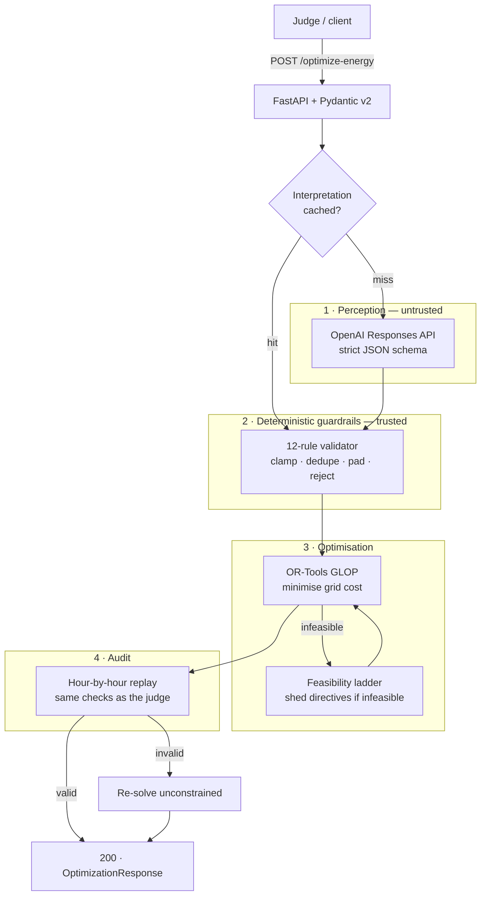

# GridWise LLM — Smart Campus Energy Optimizer

**BUP CSE Fest 2026 Hackathon · Online Preliminary Round**

An HTTP API that reads natural-language campus operator notes with an **OpenAI
model**, converts them into structured directives, validates those directives
through **deterministic guardrails**, and returns a cost-minimal 24-hour
microgrid schedule solved with **Google OR-Tools GLOP** linear programming.

| | |
|---|---|
| **Health endpoint** | `GET /health` → `{"status":"ok"}` |
| **Main endpoint** | `POST /optimize-energy` |
| **Model** | `gpt-5.6-luna` (OpenAI Responses API, strict JSON schema) |
| **Solver** | Google OR-Tools GLOP (simplex, continuous LP) |
| **Framework** | FastAPI + Pydantic v2 |
| **Required secret** | `OPENAI_API_KEY` — nothing else |

On the 10 public sample cases the solver reaches the reference optimal cost
**exactly** (cost ratio 1.00000 on all 10, replay-validated).

---

## 1. Quickstart — from a clean machine

Requires Python 3.12+ and an OpenAI API key.

```bash
git clone https://github.com/Atia-Farha/gridwise-llm.git
cd gridwise-llm

python -m venv .venv
source .venv/bin/activate          # Windows: .venv\Scripts\activate
pip install -r requirements.txt

cp .env.example .env               # then edit .env and set OPENAI_API_KEY
uvicorn app.main:app --host 0.0.0.0 --port 8000
```

The service is ready when the log prints `GridWise service ready.`

### Verify health

```bash
curl -s http://localhost:8000/health
```

```json
{"status":"ok"}
```

### Run one public sample case

```bash
python -c "import json;print(json.dumps(json.load(open('sample_cases/public_cases.json'))['cases'][0]['input']))" \
  | curl -s -X POST http://localhost:8000/optimize-energy \
      -H 'Content-Type: application/json' -d @- \
  | python -m json.tool
```

Expected result for `SAMPLE-01` — note 0 becomes a `solar_reduction` over hours
`[12, 13]` with `factor: 0.25`, note 1 is a `no_op`, and the cost matches the
reference optimum:

```json
{
  "scenario_id": "SAMPLE-01",
  "directive_interpretation": [
    {
      "note_index": 0,
      "applies": true,
      "directive_type": "solar_reduction",
      "structured_adjustment": {"hours": [12, 13], "factor": 0.25},
      "explanation": "Panel cleaning leaves 25% of forecast solar."
    },
    {
      "note_index": 1,
      "applies": false,
      "directive_type": "no_op",
      "structured_adjustment": null,
      "explanation": "Administrative notice; no effect on today's schedule."
    }
  ],
  "hourly_plan": [ /* 24 entries, hours 0–23 */ ],
  "total_grid_kwh": 2692.5,
  "total_cost_bdt": 38365.0,
  "peak_grid_kwh": 175.0,
  "plan_summary": "Applied operator directives: solar reduced to 25% in hours [12, 13]. …"
}
```

`total_cost_bdt` is `38365.0`, matching the reference optimum for this case.
The hourly action sequence may differ from the reference schedule; any
schedule reaching the same cost under the same directives is equally valid.

### Run the test suite

```bash
pytest tests/ -q          # 95 tests, fully offline — no API key needed
```

The suite mocks the model deliberately so it is deterministic and free to run.
To measure the **live** model against the 10 public cases:

```bash
export OPENAI_API_KEY=sk-...
python scripts/eval_interpretation.py
```

```
Model:  gpt-5.6-luna
Effort: low
Cases:  10 × 1 run(s)

SAMPLE-01        PASS  2/2 notes   1.42s
...
──────────────────────────────────────────────────────────
Notes correct : 18/18
Cases perfect : 10/10
Latency       : mean 1.51s  p95 2.20s
──────────────────────────────────────────────────────────
```

Useful flags: `--case SAMPLE-03`, `--model gpt-5.6-terra`, `--repeat 3`
(paraphrase stability), `--effort medium`.

### Verify a running deployment

`scripts/verify_deployment.py` scores a **live URL** end to end and needs no
local API key, because the deployed service holds one. It replays every
returned schedule against the **organizer ground-truth** directives — not
against the service's own reading — so a correct extraction paired with a
non-compliant schedule still fails.

```bash
python scripts/verify_deployment.py https://your-host
```

Measured against the live deployment:

```
case          interp   sched    ratio    time
----------------------------------------------
SAMPLE-01   2/2           OK  1.00000   0.84s
...
SAMPLE-10   3/3           OK  1.00000   4.18s
----------------------------------------------
Notes correct        : 18/18
Cases interp-perfect : 10/10
Cases schedule-valid : 10/10
Cost quality (avg)   : 1.00000  -> 10.00/10 pts
Latency              : mean 2.10s  p95 4.18s
----------------------------------------------
```

### Interactive docs

| UI | URL |
|---|---|
| Swagger | `http://localhost:8000/docs` |
| ReDoc | `http://localhost:8000/redoc` |
| OpenAPI JSON | `http://localhost:8000/openapi.json` |

---

## 2. Configuration

Only `OPENAI_API_KEY` is required. Every other variable has a working default,
so a missing value never prevents the service from starting.

| Variable | Required | Default | Purpose |
|---|---|---|---|
| `OPENAI_API_KEY` | **yes** | — | OpenAI API key |
| `OPENAI_MODEL` | no | `gpt-5.6-luna` | Model used for note interpretation |
| `OPENAI_REASONING_EFFORT` | no | `low` | `none`/`low`/`medium`/`high`/`xhigh`/`max` |
| `OPENAI_TIMEOUT_SECONDS` | no | `12` | Per-attempt timeout |
| `OPENAI_MAX_ATTEMPTS` | no | `3` | Retry budget |
| `LLM_DEADLINE_SECONDS` | no | `18` | Wall-clock cap across all attempts |
| `REDIS_URL` | no | *(empty)* | Shared cache; empty uses in-process only |
| `CACHE_TTL_SECONDS` | no | `86400` | Cache entry lifetime |
| `PORT` | no | `8000` | HTTP port |
| `LOG_LEVEL` | no | `INFO` | Log verbosity |
| `NUMERIC_TOLERANCE` | no | `0.01` | Float comparison tolerance (§11.5) |

**Model choice.** `gpt-5.6-luna` is OpenAI's cost-optimised tier
($0.20/$1.20 per M tokens) and supports strict `json_schema` structured
outputs, which is what this pipeline needs: a small, fast, schema-bound
extraction. `OPENAI_MODEL=gpt-5.6-terra` is a drop-in escalation if a future
note set needs more capability — run `scripts/eval_interpretation.py` against
both and compare before switching.

---

## 3. Architecture



The design principle is that **natural language never reaches the solver
directly**. The model produces structured candidates; deterministic code
decides what the optimizer is allowed to see.

### 3.1 The model's role (mandatory LLM requirement)

The OpenAI model is the *only* component that reads operator notes. It is
called with a **strict JSON schema**, so the provider guarantees the response
shape — an invented directive type or a missing field is structurally
impossible rather than something the guardrails must repair afterwards.

Two design choices matter here:

* **Flattened output.** The model returns `hours`, `factor`,
  `minimum_energy_kwh` and `max_grid_kwh` as sibling nullable fields rather
  than a polymorphic nested object. Strict mode forbids the union shapes the
  nested form would need, and flattening removes a whole class of shape error.
  The public `structured_adjustment` object is re-nested deterministically in
  [llm_interpreter.py](app/services/llm_interpreter.py).
* **`applies` is never trusted to the model.** It is derived in code from the
  directive type: `applies = (directive_type != "no_op")`. The spec makes this
  a strict equivalence, so deriving it removes a possible contradiction.

No phrase table or regex decides the directive. The prompt teaches the
conversion *rules* — end-exclusive windows, remaining-fraction factors,
percentage-of-capacity reserves — and the model applies them to unseen wording.

### 3.2 Deterministic guardrails

Model output is untrusted until [guardrails.py](app/services/guardrails.py)
finishes with it:

| # | Rule | Enforcement |
|---|---|---|
| 1 | Index completeness | Missing `note_index` padded with `no_op` |
| 2 | Index ordering | Sorted strictly `0..N-1` |
| 3 | Index deduplication | Duplicates keep the first occurrence |
| 4 | Allowed enum | Unrecognised type → `no_op` |
| 5 | Applies semantics | `false` only for `no_op`, `true` otherwise |
| 6 | No-op nullity | `no_op` forces `structured_adjustment = null` |
| 7 | Hours sanitisation | Unique ints `0..23`, ascending |
| 8 | Solar factor bounds | Clamped to `0.0 ≤ factor ≤ 1.0` |
| 9 | Reserve bounds | Clamped to `0.0 ≤ reserve ≤ capacity_kwh` |
| 10 | Grid cap bounds | Clamped to `max_grid_kwh ≥ 0.0` |
| 11 | Shape integrity | Missing required fields → `no_op` |
| 12 | Safe degradation | Provider outage → all-`no_op`, never a crash |

### 3.3 Linear program

Decision variables per hour *h* ∈ {0…23}, all continuous and non-negative:
grid purchase, solar used, battery charge, battery discharge, and battery
energy after the hour.

Minimise

$$\sum_{h=0}^{23} \left( grid_h \cdot tariff_h \right) + \epsilon \sum_{h=0}^{23} \left( charge_h + discharge_h \right)$$

subject to

| Constraint | Form |
|---|---|
| Energy balance | $grid_h + solar_h + discharge_h = demand_h + charge_h$ |
| Solar availability | $0 \le solar_h \le S^{\text{eff}}_h$ |
| Battery bounds | $\max(E_{\min}, R_h) \le E_h \le C$ |
| Rate limits | $charge_h \le P^{+}_{\max}$, $discharge_h \le P^{-}_{\max}$ |
| State transition | $E_h = E_{h-1} + charge_h - discharge_h$ |
| End-of-day neutrality | $E_{23} = E_{\text{initial}}$ |

Directives enter as modifications to exactly these constraints:
`solar_reduction` scales $S^{\text{eff}}_h$; `minimum_battery_reserve` raises
$R_h$; `no_charge_window` and `no_discharge_window` pin the corresponding
variable to zero; `max_grid_window` caps $grid_h$.

The $\epsilon = 10^{-4}$ term is a tie-breaker that makes simultaneous
charge and discharge strictly suboptimal. It is excluded from the reported
cost, which is recomputed from the returned plan.

### 3.4 Two correctness guarantees in the reported plan

* **Net battery movement.** Only the net of charge and discharge is reported,
  so the two can never appear in the same hour. This is algebraically
  identical — the balance equation only ever sees `charge − discharge` — and
  it removes the possibility of reporting one leg while dropping the other.
* **State accumulated from reported values.** `battery_energy_after_kwh` is
  summed from the rounded numbers actually returned, not read from the
  solver's internal variable, so the judge's replay reproduces the response
  exactly with no floating-point drift.

`total_grid_kwh`, `total_cost_bdt` and `peak_grid_kwh` are likewise recomputed
from `hourly_plan` rather than taken from the solver objective.

### 3.5 Failure behaviour

The endpoint is designed never to fail closed, because an error response
forfeits interpretation, application, optimisation *and* reliability credit
for a case simultaneously.

| Situation | Behaviour |
|---|---|
| Provider down, slow, or rate-limited | Bounded retries under an 18 s deadline, then all-`no_op`; a valid schedule is still returned |
| Model output malformed or unsupported | Guardrails reduce the entry to `no_op` |
| Interpreted directives make the LP infeasible | Directives are shed one class at a time until it solves; the relaxation is stated in `plan_summary` |
| Replay audit rejects the plan | Re-solved unconstrained, which is always feasible |
| Malformed JSON body | `400` |
| Well-formed but semantically invalid | `422` |

### 3.6 Concurrency

The network call to OpenAI is awaited, and the CPU-bound solve runs in a
worker thread via `run_in_threadpool`. Measured under a 2 s simulated provider
delay, `/health` still answers in ~1 ms mean while an optimisation is in
flight, so concurrent judge traffic cannot stall readiness checks.

---

## 4. API contract

### `GET /health`

Returns `200` with `{"status":"ok"}`. Deliberately dependency-free — it
reports that the HTTP service is up, never that OpenAI is up, so a provider
blip cannot mark the container unhealthy.

### `POST /optimize-energy`

Request and response follow the Problem Statement exactly. Status codes:

| Code | Meaning |
|---|---|
| `200` | Successful optimisation |
| `400` | Malformed JSON body |
| `422` | Well-formed but semantically invalid request |
| `500` | Controlled internal error — no secrets, no stack traces |

---

## 5. Docker

### Pull the published fallback image

```bash
docker pull ghcr.io/atia-farha/gridwise-llm:latest

docker run -d -p 8000:8000 \
  -e OPENAI_API_KEY="$OPENAI_API_KEY" \
  --name gridwise \
  ghcr.io/atia-farha/gridwise-llm:latest

curl -s http://localhost:8000/health    # {"status":"ok"}
```

CI publishes an immutable digest on every push to `main`; the exact
`@sha256:…` reference is printed in the workflow job summary and is the one
submitted for judging.

### Build locally

```bash
docker build -t gridwise-llm:latest .
docker run --rm -p 8000:8000 -e OPENAI_API_KEY="$OPENAI_API_KEY" gridwise-llm:latest
```

### Local stack with Redis

```bash
export OPENAI_API_KEY=sk-...
docker compose -f docker-compose.local.yml up --build
```

The image runs as the non-root user `gridwise`, binds `0.0.0.0:8000`, health-
checks with the Python standard library (`python:*-slim` ships no `curl`), and
contains **no baked-in secrets** — the key is supplied at run time only.

---

## 6. Deploying on Coolify

`docker-compose.yml` is written for Coolify's generated variables. Create a new
**Docker Compose** resource pointed at this repository and Coolify will:

* issue a public domain with HTTPS and route it to container port `8000`
  (`SERVICE_FQDN_GRIDWISE_8000`);
* generate a strong Redis password on first deploy and reuse it on every
  redeploy (`SERVICE_PASSWORD_REDIS`), injecting it into both the Redis server
  and the API's `REDIS_URL`.

**The only variable you set by hand is `OPENAI_API_KEY`.** Add it under the
resource's *Environment Variables*, mark it as a secret, and deploy.

Redis is a pure accelerator: interpretations are cached by a hash of the notes
plus battery capacity and reserve, so repeated scenarios skip the model call
entirely. If Redis is unreachable the service logs a warning and falls back to
an in-process cache — a cache problem can never fail a request.

After deploying, verify from outside your network:

```bash
curl -s https://<your-domain>/health
```

---

## 7. Project structure

```text
gridwise-llm/
├── app/
│   ├── main.py                    # App factory, lifespan warm-up, error handlers
│   ├── config.py                  # Environment configuration
│   ├── api/router.py              # GET /health, POST /optimize-energy
│   ├── models/                    # Pydantic request/response/directive schemas
│   └── services/
│       ├── orchestrator.py        # Pipeline + feasibility ladder
│       ├── llm_interpreter.py     # OpenAI Responses API, strict schema
│       ├── guardrails.py          # 12 deterministic validation rules
│       ├── optimizer.py           # OR-Tools GLOP linear program
│       ├── replay_validator.py    # Independent hour-by-hour audit
│       └── cache.py               # Redis cache, in-process fallback
├── scripts/eval_interpretation.py # Live-model accuracy harness
├── tests/                         # 95 offline tests
├── sample_cases/public_cases.json # Provided public cases
├── Dockerfile                     # Multi-stage, non-root, stdlib healthcheck
├── docker-compose.yml             # Coolify stack (generated secrets)
├── docker-compose.local.yml       # Self-contained local stack
└── .github/workflows/docker.yml   # Test → build → push → smoke-test → GHCR
```

---

## 8. Secret handling

* `OPENAI_API_KEY` is read from the environment only. No key, token or `.env`
  file is committed; `.env` is git-ignored and `.dockerignore`-excluded.
* API error responses return fixed strings. Stack traces and provider error
  bodies are never echoed to clients.
* Provider exceptions are logged by **type name only**, because provider error
  bodies can quote request content.
* The published image contains no credentials; the key is injected at run time.

---

## 9. Known limitations

* **Interpretation is bounded by the model.** Deliberately ambiguous or
  self-contradictory notes may be read as `no_op`. Guardrails guarantee the
  *response* is always well-formed, not that the *reading* is always right.
* **Continuous LP, not mixed-integer.** Battery behaviour is modelled without
  binary commitment variables. The ε tie-breaker makes simultaneous
  charge/discharge suboptimal and net reporting makes it unrepresentable, but
  this is not a hard integrality constraint.
* **No round-trip efficiency or degradation.** Charging and discharging are
  lossless, matching the Problem Statement's energy-balance equation.
* **Relaxation is visible, not silent.** When interpreted directives are
  infeasible the service sheds them to stay valid and says so in
  `plan_summary`. The returned `directive_interpretation` still reports what
  was understood, since the judge scores interpretation separately from
  application.
* **Cache keys include battery parameters** because percentage-based notes
  resolve to different kWh values per scenario. Identical notes with different
  batteries are correctly treated as distinct.

---

## 10. Credits & dependencies

| Component | Role | Licence |
|---|---|---|
| [FastAPI](https://fastapi.tiangolo.com/) | HTTP framework | MIT |
| [Pydantic v2](https://docs.pydantic.dev/) | Schema validation | MIT |
| [Uvicorn](https://www.uvicorn.org/) | ASGI server | BSD-3 |
| [Google OR-Tools](https://developers.google.com/optimization) | GLOP LP solver | Apache-2.0 |
| [OpenAI Python SDK](https://github.com/openai/openai-python) | Model client | Apache-2.0 |
| [redis-py](https://github.com/redis/redis-py) | Optional cache client | MIT |
| [pytest](https://pytest.org/) | Test framework | MIT |

Challenge materials © BUP CSE Fest 2026 Hackathon, in association with Poridhi.
