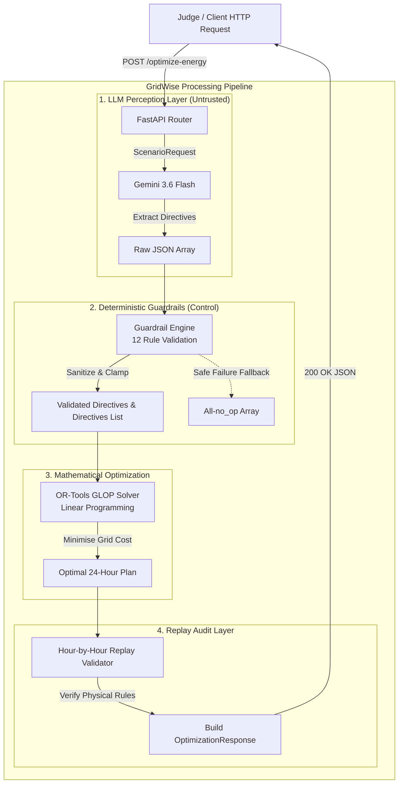

# GridWise LLM — Smart Campus Energy Optimizer

**BUP CSE Fest 2026 Hackathon · Online Preliminary Round**

An enterprise-grade HTTP API service that interprets natural-language campus operator notes using **Google Gemini 3.6 Flash**, validates extracted directives through **12 deterministic guardrails**, and produces a cost-minimised 24-hour microgrid schedule using **Google OR-Tools GLOP Linear Programming**.

---

## 🏛️ System Architecture



---

## 📋 Evaluation Checklist & Rubric Mapping

This repository is built for 100% reproducibility and strict adherence to the [Evaluation Rubric](file:///home/atia-farha/Documents/Projects/BUP_CSE_Fest_Hackathon/gridwise-llm/BUP_CSE_FEST_2026_Participant_Guide_&_Evaluation_Rubric_GridWise_LLM.md):

| Scoring Category | Points | Implementation Details |
|---|---|---|
| **LLM Directive Interpretation** | 25 | Gemini 3.6 Flash extracts structured directives; few-shot prompt ensures paraphrase robustness across hidden notes. |
| **Directive Application & Constraints** | 25 | All 5 non-no_op directive types injected into LP formulation and verified by post-solve replay validator. |
| **Optimization Quality** | 10 | Exact Linear Programming optimum using Google OR-Tools GLOP solver. |
| **API Contract & Schema** | 10 | Strict Pydantic v2 validation for `GET /health` and `POST /optimize-energy`. |
| **Performance & Reliability** | 10 | Startup solver & client pre-warming; sub-second LP execution; safe fallback handling. |
| **Deployment & Docker Fallback** | 10 | Multi-stage Docker build, non-root user execution, binds to `0.0.0.0:${PORT}` without hardcoded secrets. |
| **Documentation & Reproducibility**| 10 | Copy-paste quickstart, environment configuration guide, public sample validation scripts, and architecture docs. |

---

## 🚀 Quick Start (Local Setup)

### Prerequisites

* Python 3.12+
* A Google Gemini API Key ([Get one at Google AI Studio](https://aistudio.google.com/))

### 1. Clone & Setup Virtual Environment

```bash
git clone https://github.com/Atia-Farha/gridwise-llm.git
cd gridwise-llm

python -m venv .venv
source .venv/bin/activate    # Windows: .venv\Scripts\activate

pip install -r requirements.txt
```

### 2. Environment Configuration

Copy the example environment file and set your `GEMINI_API_KEY`:

```bash
cp .env.example .env
```

**Supported Environment Variables:**

| Variable | Required | Default | Description |
|---|---|---|---|
| `GEMINI_API_KEY` | **Yes** | — | Google Gemini API key |
| `GEMINI_MODEL` | No | `gemini-3.6-flash` | Gemini model name |
| `PORT` | No | `8000` | Server HTTP port |
| `NUMERIC_TOLERANCE` | No | `0.01` | Numeric comparison tolerance |

### 3. Run the API Service

```bash
uvicorn app.main:app --host 0.0.0.0 --port 8000
# Alternative using Makefile: make run
```

### 4. Verify Service Health

```bash
curl -s http://localhost:8000/health
# Expected Output: {"status":"ok"}
```

### 5. Validate Against Public Sample Cases

Execute a test request using the provided sample dataset:

```bash
python3 -c "
import json
cases = json.load(open('sample_cases/public_cases.json'))
print(json.dumps(cases['cases'][0]['input'], indent=2))
" | curl -s -X POST http://localhost:8000/optimize-energy \
  -H 'Content-Type: application/json' \
  -d @- | python3 -m json.tool
```

Or run the automated sample case test suite:

```bash
pytest tests/test_sample_cases.py -v
```

---

## 🤖 LLM Role & Guardrail Architecture

### Mandatory LLM Role
Google Gemini 3.6 Flash acts as the natural-language perception front-end for `operator_notes`. It converts unstructured text into a machine-readable JSON array of directive candidates.

* **Temperature**: `0.0` (deterministic extraction).
* **Automatic Function Calling (AFC)**: Explicitly disabled (`types.AutomaticFunctionCallingConfig(disable=True)`) to eliminate API latency hangs on Flash models.
* **Thought Stripping**: Strips model thinking blocks prior to JSON parsing.

### 12 Deterministic Guardrails
Raw LLM output is treated as **untrusted data**. The guardrail module ([guardrails.py](file:///home/atia-farha/Documents/Projects/BUP_CSE_Fest_Hackathon/gridwise-llm/app/services/guardrails.py)) enforces 12 deterministic rules before passing constraints to the mathematical optimizer:

| # | Guardrail Rule | Action / Enforcement |
|---|---|---|
| 1 | **Index Completeness** | Missing `note_index` items are padded with `no_op`. |
| 2 | **Index Ordering** | Output sorted strictly by `note_index` (`0..N-1`). |
| 3 | **Index Deduplication** | Duplicate `note_index` entries keep the first valid occurrence. |
| 4 | **Allowed Directive Enum** | Unrecognized types default to `no_op`. |
| 5 | **Applies Semantics** | `applies = true` for active directives; `applies = false` only for `no_op`. |
| 6 | **No-Op Nullity** | `no_op` forces `structured_adjustment = null`. |
| 7 | **Hours Sanitization** | Filtered to unique integers `0..23` in ascending order. |
| 8 | **Solar Factor Bounds** | Clamped to $0.0 \le \text{factor} \le 1.0$ (remaining fraction). |
| 9 | **Battery Reserve Bounds** | Clamped to $0.0 \le \text{reserve} \le \text{capacity\_kwh}$. |
| 10 | **Grid Cap Bounds** | Clamped to $\text{max\_grid\_kwh} \ge 0.0$. |
| 11 | **Shape Integrity** | Missing dictionary fields convert entry to `no_op`. |
| 12 | **Safe Degradation** | Complete LLM downtime falls back to an all-`no_op` array without crashing. |

---

## 🧮 Linear Programming (LP) Optimizer

Energy scheduling is solved using **Google OR-Tools GLOP** simplex linear programming solver.

### Decision Variables (for each hour $h \in \{0..23\}$):
* $grid[h] \ge 0$: Grid electricity purchased (kWh)
* $solar\_used[h] \ge 0$: Solar energy consumed (kWh)
* $charge[h] \ge 0$: Battery charge amount (kWh)
* $discharge[h] \ge 0$: Battery discharge amount (kWh)
* $E[h] \ge 0$: Battery energy state after hour $h$ (kWh)

### Objective Function:
$$\text{Minimise } \sum_{h=0}^{23} \left( grid[h] \times tariff[h] + \epsilon \cdot (charge[h] + discharge[h]) \right)$$
*(where $\epsilon = 10^{-4}$ acts as a negligible tie-breaker preventing simultaneous charge and discharge)*.

### Governing Constraints:
1. **Hourly Energy Balance**:
   $$grid[h] + solar\_used[h] + discharge[h] = demand[h] + charge[h]$$
2. **Solar Resource Bounds**:
   $$0 \le solar\_used[h] \le \text{effective\_solar}[h]$$
3. **Battery Storage Limits**:
   $$\max(\text{minimum\_energy}, \text{directive\_min}[h]) \le E[h] \le \text{capacity\_kwh}$$
4. **Hourly Rate Limits**:
   $$0 \le charge[h] \le \text{max\_charge\_kwh\_per\_hour}$$
   $$0 \le discharge[h] \le \text{max\_discharge\_kwh\_per\_hour}$$
5. **End-of-Day Neutrality**:
   $$E[23] = \text{initial\_energy\_kwh}$$
6. **Active Directive Constraints**:
   * `solar_reduction`: $\text{effective\_solar}[h] = \text{solar\_kwh}[h] \times \text{factor}$
   * `no_charge_window`: $charge[h] = 0$
   * `no_discharge_window`: $discharge[h] = 0$
   * `max_grid_window`: $grid[h] \le \text{max\_grid\_kwh}$

---

## 🐳 Docker Deployment & Fallback

### Build Docker Image

```bash
docker build -t gridwise-llm:latest .
```

### Run Container Locally

```bash
docker run -d \
  -p 8000:8000 \
  -e GEMINI_API_KEY="your_api_key_here" \
  --name gridwise \
  gridwise-llm:latest
```

### Verify Container Readiness

```bash
curl http://localhost:8000/health
# Output: {"status":"ok"}
```

> **Security Note**: The Docker image executes under a dedicated non-root user (`USER gridwise`), binds to `0.0.0.0:8000`, and contains zero baked-in secret values.

---

## 🧪 Testing & Validation

Run the complete test suite (49 passing tests):

```bash
# Run all tests
pytest tests/ -v

# Run specific modules
pytest tests/test_guardrails.py -v   # Guardrail sanitization tests
pytest tests/test_optimizer.py -v    # LP formulation tests
pytest tests/test_api.py -v          # HTTP API & Pydantic validation tests
pytest tests/test_sample_cases.py -v   # Full pipeline public case integration tests
```

---

## 🛠️ Project Structure

```text
gridwise-llm/
├── app/
│   ├── main.py               # FastAPI entrypoint, lifespan pre-warming, error handlers
│   ├── config.py             # Pydantic-settings environment variables
│   ├── api/
│   │   └── router.py         # GET /health and POST /optimize-energy endpoints
│   ├── models/
│   │   ├── directives.py     # DirectiveType enum & validated models
│   │   ├── request.py        # ScenarioRequest & battery validation
│   │   └── response.py       # OptimizationResponse schema
│   ├── services/
│   │   ├── orchestrator.py   # End-to-end pipeline orchestration
│   │   ├── llm_interpreter.py# Gemini API client & prompt extraction
│   │   ├── guardrails.py     # 12-rule deterministic guardrail engine
│   │   ├── optimizer.py      # Google OR-Tools GLOP LP solver
│   │   └── replay_validator.py # Post-solve physical schedule verifier
│   └── utils/
│       ├── constants.py      # Shared constants & tolerances
│       └── exceptions.py     # Custom exception hierarchy
├── tests/                    # 49 unit and integration tests
├── sample_cases/             # Public sample case datasets
├── Dockerfile                # Multi-stage lean build
├── docker-compose.yml        # Development environment composition
├── Makefile                  # Helper commands (run, test, docker)
├── requirements.txt          # Explicit pinned dependencies
└── README.md                 # Complete documentation
```

---

## 📜 Credits & Dependencies

* **Google OR-Tools** — Open-source Linear Programming solver (Apache 2.0)
* **Google Gemini 3.6 Flash** — Generative language model for operator note interpretation
* **FastAPI & Pydantic v2** — Modern Python web framework and data validation
* **BUP CSE Fest 2026 Hackathon** — Smart Campus Energy Optimization Challenge
